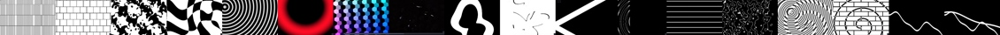
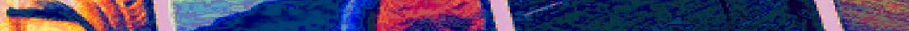
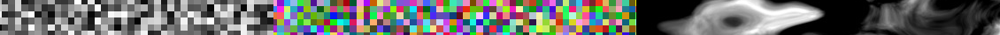
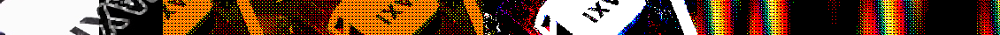

# Extra shaders for Hydra.

I'm interested in bringing a certain graphic style into an animation. A style that is interesting to me, but may not be interesting to other people.

That's why I'm currently trying to create a loosely coupled extension for atom-hydra. Working on extensions that do not touch the core of Hydra. So that you can just add them or leave them out.

Experimental code. Please do not use in production projects.


## Usage
These shaders can be added to Hydra in the browser or in the Atom Editor.

### Browser based Hydra
An additional statement must be added to the Hydra Sketch. This will load the functionality directly from the source code repository. To be clear: It is a separate repository at GitLab. Not the original Hydra repository.

Here you can find an online example for a sketch using `lib-pattern`. https://hydra.ojack.xyz/?sketch_id=8qwQ4YEoabWylEcI

Example for loading `lib-pattern.js`:
```javascript
await loadScript("https://cdn.statically.io/gl/metagrowing/extra-shaders-for-hydra/main/lib/lib-pattern.js")
```

`all.js` is a concatenation of all `lib-XXX.js` files. You can use this file to load all extensions with only one statement.

Example for loading all of these additional shaders:
```javascript
await loadScript("https://cdn.statically.io/gl/metagrowing/extra-shaders-for-hydra/main/lib/all.js")
```

### Atom based Hydra
During development I am working with the Atom editor and its Hydra package.

#### Install atom-hydra
First you need to install the Atom version of Hydra.
https://github.com/ojack/atom-hydra

#### Load additional GLSL shaders
- Load this [lib/lib-pattern.js](./lib/lib-pattern.js) file into an additional buffer in the Atom editor.
- Toggle the Atom editor to activate Hydra mode.
- Send this additional buffer to the Hydra rendering engine by pressing `CTRL+ENTER`.
- Then you can work with this extended set of shaders as usual from your Hydra sketch file.


## Op-art patterns



These additional fragment shaders are inspired by op-art patterns. They are defined in [lib-pattern](./lib/lib-pattern.js).

Here is the description of [lib-pattern](./gallery/pattern/README.md).

Find examples made with `lib-pattern` in this folder: [examples/pattern](./examples/pattern).


## Color filters



These additional are filters for mixing or manipulating colors. Some of the filters are rather subtle, others create strong effects. They are defined in [lib-color](./lib/lib-color.js).

Here is the description of [lib-color](./gallery/color/README.md).

Find examples made with `lib-color` in this folder: [examples/color](./examples/color).


## Noise



These additional fragment shaders are inspired by work of F. Kenton Musgrave. They are defined in [lib-noise](./lib/lib-noise.js).

Here is the description of [lib-noise](./gallery/noise/README.md).

Find examples made with `lib-noise` in this folder: [examples/noise](./examples/noise).


## Screen space filters

These additional shaders work in the last stage of the filter pipeline. They add an effect to an existing animation. For example, blurring or rasterizing the image.



They are defined in [lib-screen](./lib/lib-screen.js).

Here is the description of [lib-screen](./gallery/screenspace/README.md).

Find examples made with `lib-screen` in this folder: [examples/screenspace](./examples/screenspace).


## Limitations
- Do not use empty lines inside a lib-xxx.js file. Sending the whole file in on bunch with `CTRL+ENTER` will not work if this file is containing empty lines.
- Only tested on a high end graphics card. May be to slow for other devices.


## Hydra
These packages with extra shaders are made for the awesome Hydra live coding environment. Hydra is developed by Olivia Jack.

https://hydra.ojack.xyz/

https://github.com/hydra-synth
