# Color filter
These are filters to mix or change colors. Some of the filters are rather subtle, others create strong effects. All filters are designed so that the original image can be mixed with the filter effect. This is especially useful with the intense filters. But even with more subtle filters like the sepia effect, it can look good if some of the original coloring still remains visible in the output.

## Additional shaders
Load 

## Examples
Find examples made with `lib-color` in this folder: [examples/color](./../../examples/color).

## Sepia
This filter is of type `color`.

### Sepia filter:

`sepia( amount )`

* `amount` :: float (default `1.0`)

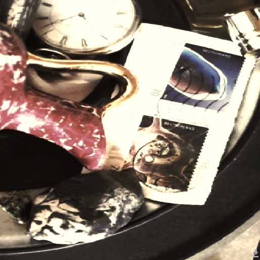

## Reduce color levels

These filters are very similar to the `posterize` filter in Hydra. The difference is that the color reduction preserves more of the light-dark dynamics of the original image.

These filters are of type `color`.

### Levels filter:

`levels( levels, amount )`

* `levels` :: float (default `3.0`)
* `amount` :: float (default `1.0`)

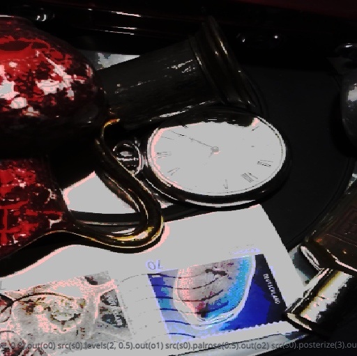

### Monotone filter:

`monotone( levels, hue, amount )`

* `levels` :: float (default `3.0`)
* `hue` :: float (default `0.6`)
* `amount` :: float (default `1.0`)

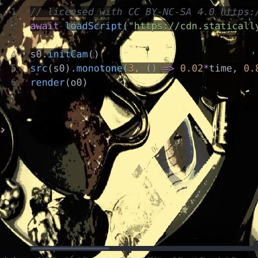

## Color gradients
These filters transfer the original image into a given color palette. To do this, the input data is first converted to grayscale and then the new color value is calculated from a gradient. These filters include the gradient in the source code. So they are not very flexible.

If you want other color palettes you can find examples here. https://github.com/kbinani/colormap-shaders/blob/master/shaders/glsl/

These algorithms published by *kbinani* then have to be transferred to Hydra's `setFunction` scheme.

These filters are of type `color`.

### Rose gradient filter:

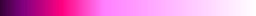

`grarose( amount )`

* `amount` :: float (default `1.0`)

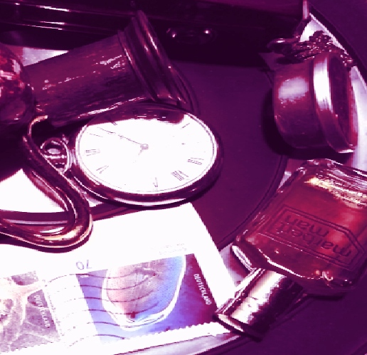

### Wave gradient filter:
A gradient can contain rhythmic repetitions. This one creates color bands.

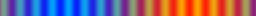

`grawave ( amount )`

* `amount` :: float (default `1.0`)

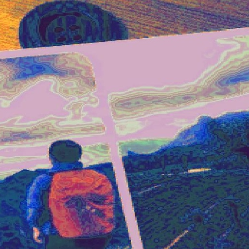

## Combining colors with vector math
These filters create very strong color effects. Vector operations are applied to the RGB values of the input data. Usually vector product, dot product and normalization are intended for the transformations of 3D coordinates in space. If you process the RGB color channels instead of the X-Y-Z position, you get very colorful output. It is possible to attenuate these effects with a small `amount` value.

These filters are of type `combine`.

### RGB cross product:

`colcross( amount )`

* `amount` :: float (default `1.0`)

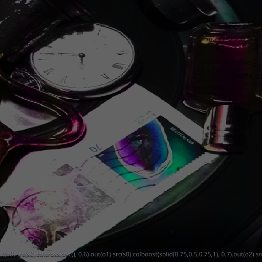

### RGB dot product of rotated channels:

`coldot( amount )`

* `amount` :: float (default `1.0`)

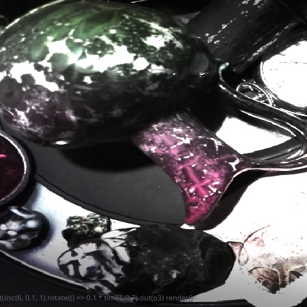

### Color booster:

`colboost( amount )`

* `amount` :: float (default `1.0`)

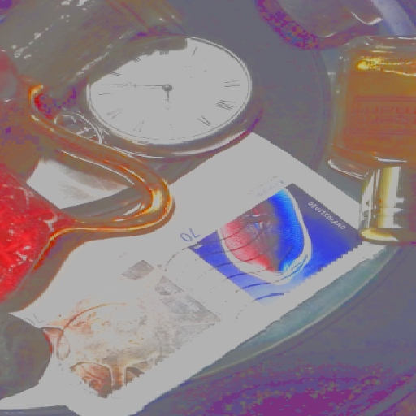

### Color reflector:

`colreflect( amount )`

* `amount` :: float (default `1.0`)

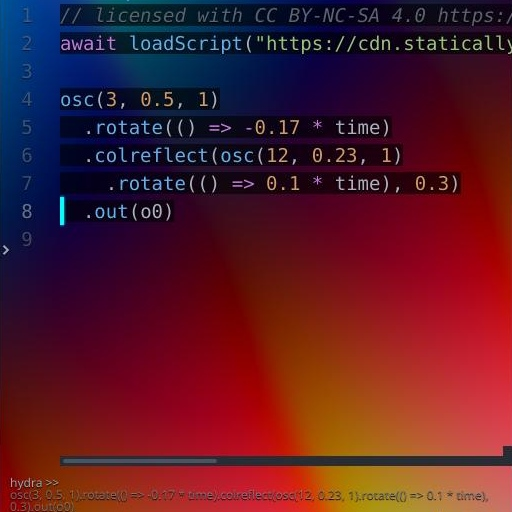
