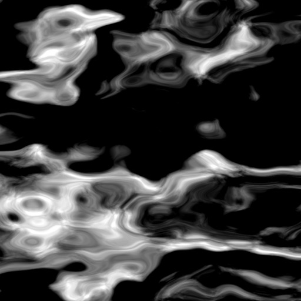

# Noise generators

## Additional shaders
Load 

## Examples
Find examples made with `lib-noise` in this folder: [examples/noise](./../../examples/noise).

## Description
All patterns are of type `src`.

### Black and white high frequency noise

`whitenoise( size, dynamic )`

* `size` :: float (default `10.0`)
* `dynamic` :: float (default `0.0`)

### Colored high frequency noise

`colornoise( size, dynamic )`

* `size` :: float (default `10.0`)
* `dynamic` :: float (default `0.0`)

### Unsigned Perlin noise

Like the original `noise` function in Hydra. But approximately scaled to then range `0 .. 1`.

`unoise( scale, offset )`

* `scale`  :: float (default `10.0`)
* `offset` :: float (default `0.1`)

### Turbulent noise
Adding more octaves to a Perlin noise.

The result is a signed value.

`turb( scale, offset, octaves )`

* `scale`   :: float (default `10.0`)
* `offset`  :: float (default `0.1`)
* `octaves` :: float (default `3.0`)

### Unsigned turbulent noise
Like `turb`. But approximately scaled to then range `0 .. 1`.

`uturb( scale, offset, octaves )`

* `scale`   :: float (default `10.0`)
* `offset`  :: float (default `0.1`)
* `octaves` :: float (default `3.0`)

### Domain warping noise

`warp( scalei, offset, octaves, octavesinner, scale )`

* `scalei`       :: float (default `10.0`)
* `offset`       :: float (default `0.1`)
* `octaves`      :: float (default `2.0`)
* `octavesinner` :: float (default `3.0`)
* `scale`        :: float (default `1.0`)

### Centered domain warping noise
Like warp. The Effect is more focused to the center.

`cwarp( scalei, offset, octaves, octavesinner, scale, focus )`

* `scalei`       :: float (default `10.0`)
* `offset`       :: float (default `0.1`)
* `octaves`      :: float (default `2.0`)
* `octavesinner` :: float (default `3.0`)
* `scale`        :: float (default `1.0`)
* `focus`        :: float (default `0.5`)

