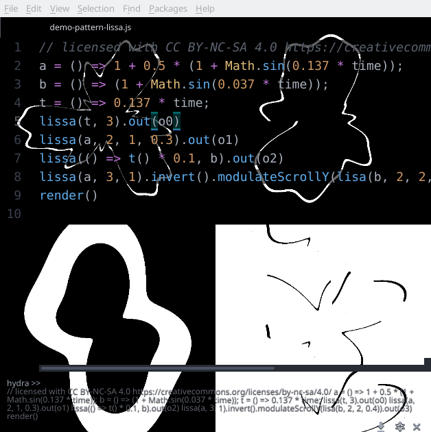

# Op-art patterns

## Additional shaders
Load 

## Examples
Find examples made with `lib-pattern` in this folder: [examples/pattern](./../../examples/pattern).

## Description
All patterns are of type `src`.

### Brick pattern:

see: Ebert, Musgrave, Peachey, Perlin Worley
"Texturing and Modeling – A Procedural Approach"

Darwyn Peachey, Building Procedural Textures, page 37

`brick( width, height, gap )`

* `width` :: float (default `0.25`)
* `height` :: float (default `0.08`)
* `gap` :: float (default `0.01`)

### Checkerboard pattern:

`checker(  )`

* `repeats` :: float (default `10.0`)

### Concentric circles pattern:

`concentric( scale, centerX, centerY )`

* `scale` :: float (default `100.0`)
* `centerX` :: float (default `0.5`)
* `centerY` :: float (default `0.5`)

### Hex tiles pattern:
see: https://andrewhungblog.wordpress.com/2018/07/28/shader-art-tutorial-hexagonal-grids/

`hextile( tiles )`

* `tiles` :: float (default `10.0`)

### Lissajous curve pattern:
see: https://en.wikipedia.org/wiki/Harmonograph

`lissa( time, frequ, loops, thick )`

* `time` :: float (default `0.0`)
* `frequ` :: float (default `10.0`)
* `loops` :: float (default `3.0`)
* `thick` :: float (default `0.025`)

### Pulse pattern:
More infos in can be found in this book:

Ebert, Musgrave, Peachey, Perlin Worley
"Texturing and Modeling – A Procedural Approach"

`pulse( edge, width, epsilon )`

* `edge` :: float (default `0.5`)
* `width` :: float (default `0.05`)
* `epsilon` :: float (default `0.001`)

### Pulse train pattern:

`pulsetrain( train, edge, width, epsilon )`

* `train` :: float (default `3.0`)
* `edge` :: float (default `0.5`)
* `width` :: float (default `0.05`)
* `epsilon` :: float (default `0.001`)

### Spiral pattern:

`spiral( a, b, thickness )`

* `a` :: float (default `1.0`)
* `b` :: float (default `5.0`)
* `thickness` :: float (default `0.1`)

### Wave pattern:

`wave( time, frequ, loops, thick )`

* `time` :: float (default `0.0`)
* `frequ` :: float (default `10.0`)
* `loops` :: float (default `3.0`)
* `thick` :: float (default `0.025`)

