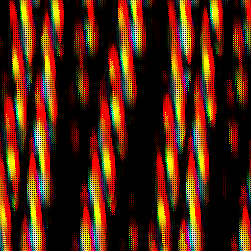

# Screen space operations
Most of these additional shaders work in the last stage of the filter pipeline. They add an effect to an existing animation. For example, blurring or rasterizing the image.

These GLSL shaders are not fully compatible with the fragment shader code generated by Hydra.

* They ignore the geometric transformation. Instead they work them in screen space. This means they use gl_FragCoord directly to access the texture.
* These filters should not be used multiple times in the same filter chain.
* Do not rescale your Hydra window. This will destroy the effect, because it needs that every pixel is drawn witout scaling on your monitor.

### Multi Pass rendering
`dilate` and `erode` are simple image transformations to remove noisy pixels or increase small details.

*Opening* and *Closing* transformation are a little bit more complicated. Because these morphological operators are mostly used in a sequence of multible *Dilate* followed by one *Erode*. They need multi pass rendering.

https://docs.opencv.org/3.4/d9/d61/tutorial_py_morphological_ops.html

This notation does **not** work:
`my_sketch().dilate().dilate().erode().out(o0)`

To achieve a multi pass result instead use multible buffers in Hydra.
```javascript
my_sketch().out(o0)
src(o0).dilate().out(o1)
src(o1).dilate().out(o2)
src(o2).erode().out(o3)
render(o3)
```


## Additional shaders
Load 

## Examples
Find examples made with `lib-screen` in this folder: [examples/screen](./../../examples/screen).

## Description
All patterns are of type `color`.

### Black and white ordered dithering:

`dither()`

* no parameters available


### Ordered dithering pattern with colors:

Using a 2x2 Bayer matrix for heavy color reduction.

`dither2()`

* no parameters available


### Ordered dithering pattern with more colors:

Using a 4x4 Bayer matrix to preserve more colors.

`dither4()`

* no parameters available





### Black and white random dithering:

`ditherrnd()`

* no parameters available


### Random dithering preserving some colors:

`ditherrndcolor()`

* no parameters available


### Morphological erode operator:

`erode()`

* no parameters available


### Morphological dilate operator:

`dilate()`

* no parameters available


### Gaussian blur:

Applying a 3x3 Gaussian blur convolution matrix to blur the texture a little.

`blur()`

* no parameters available


### More Gaussian blur:

Applying a 5x5 Gaussian blur convolution matrix to blur the texture.

`blurmore()`

* no parameters available


### Simple sharpening filter:

Applying a 3x3 convolution matrix to sharpen the texture.

`sharpen()`

* no parameters available


### Embossing Filter:

`emboss()`

* no parameters available


### Edge detection:

Applying a 3x3 convolution matrix for edge detection.

`edge()`

* no parameters available


### Sobel-Operator for edge detection:

First applying two Sobel like 3x3 convolution matrices. Then adding the results. This is can be usefull for edge detection.

````javascript
s0.initCam();
src(s0).sobelx().out(o1);
src(s0).sobely().out(o2);
src(o1).add(o2).out(o3);
render(o3)
````

`sobelx()`

* no parameters available

`sobely()`

* no parameters available


````javascript
s0.initCam();
src(s0).sobelx().out(o1);
src(s0).sobely().out(o2);
src(o1).add(o2).out(o3);
render(o3)
````
